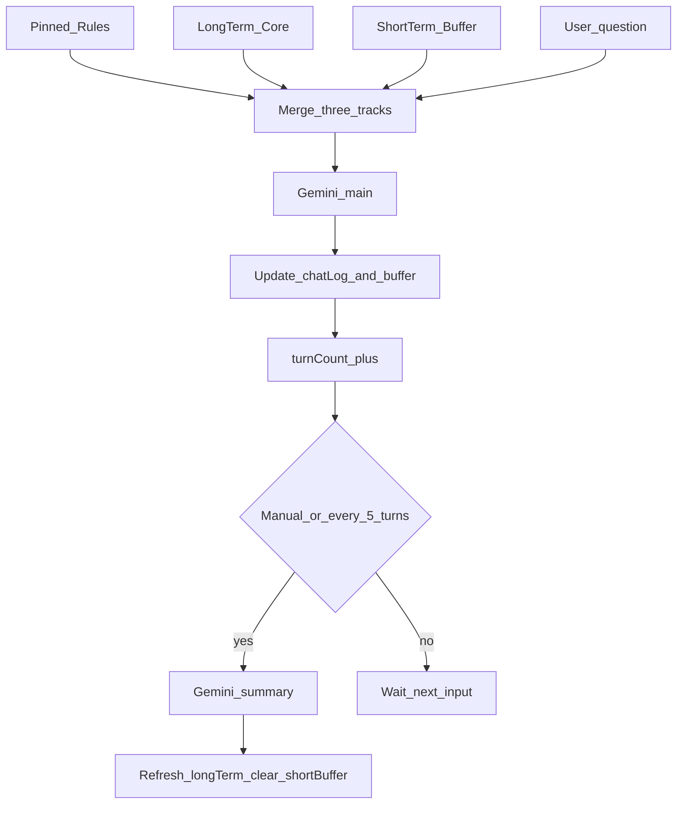
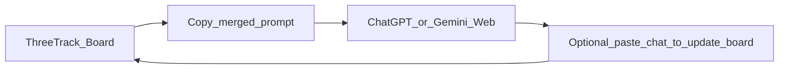

# 실현 난이도 · 3주 가능 여부 (재조사 · 수업 기준)

전제: 코딩 초보 + Cursor 바이브코딩 + 혼자 + 부트캠프 일정(v1 8/7 · v2 8/12 · v3 8/17).  
제품: **이어롤** (캐릭터/스토리 롤플챗, Gemini Flash, 제타 일반 약점 겨냥).

## 총평

| 항목 | 판정 |
|------|------|
| 전체 난이도 | **중** (입문자+바이브코딩 기준) |
| 3주 안 “수업 통과급” 가능? | **가능** |
| 3주 안 “기획서 풀스펙 전부”? | **어려움** — 범위 자르면 됨 |
| v1(8/7) 데모 가능? | **가능** — Must+Should 핵심만 |
| 제타 일반을 데이터로 ‘이김’ 증명? | **조건부 가능** — 좁은 데모 시나리오 한정 |

---

## 기능별 난이도 (현재 스펙)

| 기능 | 난이도 | 3주 안 | 비고 |
|------|--------|--------|------|
| 캐릭터 프로필 카드 (Must) | 하 | ✅ | HTML 폼+글자 수 |
| 설정 고정 주입 + Gemini 채팅 (Should) | 중 | ✅ v1 핵심 | fetch/JSON/키 — 바이브로 가능 |
| 나레이션/대사 분리 UI (Should) | 중하 | ✅ v1 | 정규식 파싱, 실패 시 통짜 폴백 |
| 스토리 자동 요약 루프 (Should) | 중 | △ v1 수동 / v3 자동 | 자동+레이스는 시간 먹음 |
| 세계관 칸 | 하 | ✅ | 프로필과 동일 패턴 |
| 짧은 출력 강제 | 하 | ✅ | 프롬프트+maxTokens |
| 유저 페르소나·등장인물·글자 수 | 하 | ✅ 선택 | |
| 로컬 자동 저장 (Must) | 하 | ✅ **필수** | API키·설정·요약·채팅 LocalStorage 동기화 |
| 기억 패널 미리보기 | 하 | ✅ | 왼쪽 패널이 곧 미리보기 |
| React/Supabase/로그인 (수업 v2) | 중 | ✅ 수업 따라가면 | 이전이 병목 |
| Next/Firebase (수업 v3) | 중 | ✅ 수업 따라가면 | 기능 추가보다 이식 |
| 새 인물 자동·이미지·확장·제타급 UX | 상 | ❌ | Won't 유지 |

---

## 일정별 실현성

### v1 (~3일: 8/5~8/7) — **가능 · 타이트**

넣어야 할 최소:
1. 프로필(+세계관 간단)  
2. Gemini 채팅 + 설정 매 턴 주입  
3. 나레이션/대사 파싱 표시  
4. Netlify 배포  

넣어야 함: **LocalStorage 자동 저장**(키·설정·채팅·요약), 수동 기억 압축, 짧은 출력.  
**빼도 됨:** 자동 5턴 루프, 로그인, 예시 캐릭 버튼.

리스크: API 키·CORS/모델명·포맷 미준수.  
→ 폴백(통짜 표시)+모델명 AI Studio 확인으로 완화.

### v2 (8/10~12) — **수업 의존 · 가능**

난이도는 React/Supabase **학습 곡선**이지, 캐릭터챗 로직 자체가 아님.  
목표: UI 이전 + 저장. 자동 요약 완성 강요 금지.

### v3 (8/13~17) — **가능**

자동 요약 루프·다듬기·Vercel.  
발표는 **한 캐릭터·채점표 데모**면 충분.

---

## 초보+바이브코딩에서 실제로 막히는 지점

1. Gemini 호출 실패 (키·모델 ID·쿼터) — **중**  
2. 모델이 포맷/설정을 무시 — **중** (완벽 해결 불가, 데모 시나리오 축소로 대응)  
3. HTML → React → Next **세 번 이식** — **중상** (수업 예제 따라가기, 매 버전 ‘동작하는 URL’만 목표)  
4. 자동 요약 중 입력 꼬임 — **중** (v1은 수동만)

---

## 권장 성공 기준 (수업용)

- **Must 통과:** 프로필 저장·표시 + **LocalStorage(새로고침 후 이어짐)**  
- **데모 통과:** 주입 채팅 + 말투 유지 체감 10턴 + 나레이션/대사 구분 + Netlify URL  
- **우수:** 수동 요약 + 대행 금지 고정 규칙 + 제타 일반과 같은 설정 비교 채점 + 화면 A 발급 링크  
- **욕심 (실패해도 OK):** 자동 루프, Supabase 로그인, 완벽한 개연성  

---

## 최종 한 줄

**난이도 중, 3주 가능.**  
다만 “기획서에 적힌 전부”가 아니라 **v1에 주입 채팅+포맷 UI를 넣고, 자동 요약·풀 스택 이전은 수업 페이스에 맡기는 것**이 현실적이다.

---

# 제품 재정의: 캐릭터/스토리 챗 (타당 · 이름·스펙 확정)

## 0. 이 변화는 타당한가? → **타당**

| 질문 | 답 |
|------|-----|
| 만능 제미나이 대체? | 아님 → 경로의존·기능 열위 피할 수 있음 |
| 쓰리 트랙과 맞나? | **더 잘 맞음** (설정집 / 스토리 요약 / 최근 대사) |
| 제타·크랙·케덕 이기나? | **시장 점유 경쟁 목표 아님**. 3주 토이는 “개인용·기억이 보이는 롤플” |
| 고칠 것 | 이름·한 줄 목표·개발 이유·페르소나·UI·출력 포맷 **전부 스토리용으로** |

개발 이유 (새로):  
가장 흔한 캐릭터챗 **제타의 일반 모델**은 기억 상실·개연성 붕괴가 잦고 광고가 많다.  
우리는 Gemini를 빌려 **설정·세계관을 고정 주입하고 스토리를 요약 루프로 유지**하는 개인용 롤플 창으로, 그 구간에서 더 안정적이고 광고 없는 경험을 만든다.  
(제타 전체·캐릭터 상점·이미지를 이기려는 목표가 아님.)

---

## 1. 이름 · 한 줄 (확정안)

- **서비스명**: **이어롤** (이어 + Role)  
  - 옛 이름: 설정고정 / 메모리 루프 챗 (폐기·코드 참고용만)  
- **한 줄**: 길게 놀아도 캐릭터 설정이 이어지는 개인용 스토리 롤플 채팅  
- **공식**: 캐릭터·스토리로 AI랑 오래 노는 사람이, 대화가 길어질 때, 설정·말투가 무너지는 문제를, 꼭 지킬 설정을 따로 두어 이어 가게 해결하는 서비스

---

## 1-0. 지능 기능 2주 계획 (2026-08-09 반영 · 재검토·피드백 정합)

기존 캐릭챗(제타 로어북·상태창·선택지 등) 참고 후 결정.  
**통과 전제 = LocalStorage Must.** **통과 = 수동 요약까지.** 자동 요약은 목표 상한(여유/v3), 완주 조건 아님.

| 순위 | 기능 | 등급 |
|------|------|------|
| 0 | **LocalStorage 자동 저장** (키·설정·요약·채팅) | **Must** · 이탈 방지 |
| 1 | 설정 주입 채팅 + 나레이션/대사 + **수동** 스토리 요약 | Should · **통과·최우선** |
| 2 | 유저 대사 대행 금지 (고정 주입 구체 문장) | Should · **우수** |
| 3 | 미니 상태창 · 자동 요약 | Could · 욕심 (자동은 v3 보너스) |
| — | 로어북·선택지·호감도·멀티캐릭·RAG·이미지 | Won't · 세계관 칸으로 로어북 대체 |

### 고정 주입(Pinned) 프롬프트 규칙 (피드백 반영)

```text
[규칙]
- 너는 {{캐릭터 이름}}의 시점과 행동만 서술한다.
- 절대로 {{유저 이름}}의 대사·감정·행동을 대신 쓰지 않는다.
- 나레이션: (나레이션) ...
- 대사: 이름: 「...」
- 짧게: 나레이션 1~3문장 + 대사 2~5줄. OOC 금지.
```

화면 A: AI Studio **「무료 API 키 1분 만에 발급받기」** 링크 + 키 입력 `type="password"`.

---

## 1-1. 페르소나 (재설정)

### 박하준 · 21 · 컴퓨터공학과 2학년

**1. 기본**  
코딩은 수업·과제 수준. 밤에 제타로 캐릭터 롤플하는 게 취미에 가깝다. 세계관 장인 아님. 설정은 짧게, 바로 놀고 싶어 함.

**2. 하루 일과 속 상황**  
과제 끝나면 제타 켠다. 캐릭터 고르고 티키타카. 광고 스킵. 말투가 이상해지면 새 채팅 파거나 “다시 존댓말로” 한 줄 보냄.

**3. 목표**  
오늘 밤만 몰입하고 자고 싶다. 캐릭터 관계·말투가 안 깨졌으면 좋겠다. API·긴 설정 폼은 싫다.

**4. 불편함**  
제타 **일반 모델** 기준: 기억 상실, 개연성 붕괴, 광고.  
그래도 캐릭터 많고 익숙해서 잘 안 떠난다.

**5. 지금의 대안**  
참고 쓰기 / 새 채팅 / 한 줄 정정. 메모장 로어는 곧 포기.

**6. 우리(이어롤)를 쓰는 순간**  
설정이 또 무너진 날 링크를 연다. 프로필·세계관을 짧게만 적고 채팅.  
10턴쯤에도 말투가 유지되면 며칠 더 씀.  
키 입력이 막히거나 체감이 제타랑 비슷하면 **바로 제타로 복귀**.

**제품에 요구**  
빠른 시작 · 10~15턴 기억/개연성 체감 · 무광고 · API 키는 한 번만 단순하게.

---

## 2. 경쟁 목표 · 차별점 (확정)

### 이기는 대상 (좁게)
**제타 전체/유료 고성능이 아니라, 제타의 일반(기본) 모델.**

제타 일반 모델의 체감 약점:
1. **기억 상실** — 앞에서 정한 설정·사건을 잊음  
2. **개연성 붕괴** — 말투·세계관·관계가 갑자기 어긋남  
3. **광고** — 몰입 중 끊김  

우리의 승부: 같은 “가벼운 롤플” 구간에서  
**설정·스토리가 덜 무너지고, 광고 없이** 이어지게 한다.

### 우리가 이기는 방법 (제품)
| 제타 일반 | 이어롤(우리) |
|-----------|----------------|
| 기억이 불투명 | **설정집·세계관·스토리 요약이 화면에 보임 + 매 턴 강제 주입** |
| 개연성 붕괴 | 세계관/금지는 **요약에 안 넣음**(고정 트랙) |
| 광고 | **광고 없음** (대신 사용자 Gemini API 키) |

### 우리가 안 이기는 것 (솔직히)
캐릭터 풀, 이미지/스냅샷, 가입만 하면 되는 편의, 커뮤니티, 검열 정책 전쟁.  
발표 문장:

> “제타를 대체하려는 게 아니라, **제타 일반 모델이 자주 놓치는 기억·개연성·광고**를 개인용 롤플 창에서 잡는다.”

### 데모로 ‘이겼다’ 판정 (측정 가능)
같은 캐릭터 설정으로 제타 일반 vs 우리 각 10~15턴 후:
- 말투/금지 위반 횟수
- 이전에 정한 사건 모순 횟수  
우리 쪽이 명확히 적으면 성공.

---

## 3-1. Gemini 모델은 어떻게 정하나? (확정)

### 결정 주체
- **우리가 기본값을 고른다** (코드에 기본 모델 ID 고정).
- v1에서 유저가 모델을 고르게 할 필요는 없음. ( entree 복잡)
- v2~: 상단에 **모델 선택 드롭다운**(선택 사항). 기본은 그대로 Flash.

### 고르는 기준 (캐릭터챗)
| 기준 | 선택 |
|------|------|
| 속도·비용 | **Flash** 계열 (Pro는 v1 비추 — 느리고 비쌈) |
| 역할 | 채팅 대사 · 스토리 요약 **같은 모델** (초보·디버깅 단순) |
| 출력 | 짧게 쓸 거라 Flash로 충분 |
| 제타 일반과 비교 | “더 큰 모델”이 아니라 **기억 주입 구조**로 이긴다 |

### 기본 모델 (2026-08 기준 권장)
Google이 2.0 Flash를 종료(2026-06)했으므로, **구현 시점에 AI Studio에서 살아있는 Flash**를 쓴다.

- 1순위: `gemini-2.5-flash` 또는 문서 권장 후속 **`gemini-3.5-flash` / `gemini-3.6-flash`** 중 **키가 호출되는 것**
- 확인 방법: [Google AI Studio](https://aistudio.google.com) → 모델 목록 / `GET .../v1beta/models`
- 코드: `const MODEL = "gemini-...-flash"` 한곳만. 죽으면 문자열만 교체.

### 정리
모델은 **플랫폼이 자동 배정하지 않음**.  
우리가 Flash를 기본으로 박고, API URL에 그 ID를 넣어 호출한다.  
승부는 모델 등급이 아니라 **이어롤의 설정 주입 + 스토리 루프**.

---

시스템 프롬프트로 **짧게 강제**.

- 목표: **나레이션 1~3문장 + 대사 2~5줄** (한글 기준 대략 **250~450자**, 절대 소설 한 편 금지)
- Gemini `maxOutputTokens`도 낮게 (예: 300~500 토큰 수준으로 실험 후 고정)
- 어기면 UI에 “다시 짧게” 버튼 (v1 선택)

이유: 줄글 남발 = 몰입 깨짐 + 비용 + 모바일 스크롤 지옥. 캐릭터챗은 **짧게 자주**.

---

## 4. 대사 vs 나레이션 구분 (확정) + 대행 금지

### 모델에게 강제하는 출력 포맷 · 시점 규칙

```text
[Pinned 규칙]
너는 {{캐릭터 이름}}의 시점과 행동만 서술한다.
절대로 {{유저 이름}}의 대사·감정·행동을 대신 쓰지 않는다.

(나레이션) ...행동·장면 묘사...
이름: 「대사」
이름: 「대사」
```

- 나레이션/대사: **`(나레이션)` + `이름: 「」`** 로 확정 (CSS·정규식 분리용 고정 기호)
- “유저 대사 쓰지 마” 한 줄만으로는 부족 → **시점·대행 금지 문장을 매 턴 고정 주입**
- OOC(설정 밖 설명) 금지. 필요하면 유저가 설정집에서 고침

### UI에서

| 종류 | 보이게 |
|------|--------|
| 나레이션 | 회색·이탤릭, 말풍선 아님 |
| 대사 | 캐릭터 말풍선 (이름 라벨) |
| 유저 | 오른쪽 말풍선 |

파싱: 줄 단위로 `(나레이션)` / `이름:` 정규식. 실패하면 통짜 회색 박스로 폴백.

---

## 5. UI (v1 와이어)

```text
┌─ 상단: 캐릭터 이름 · API키 · 상태 ─────────────────┐
├─ 왼쪽(좁) ─────────────┬─ 오른쪽(넓) 채팅 ────────┤
│ [프로필 카드]           │  (나레이션) ...           │
│  이름 / 한줄소개      │  엘라: 「...」            │
│  이미지 URL(선택·텍스트)│  나: 「...」              │
│                         │                          │
│ [설정집] textarea       │                          │
│  말투·금지·세계관       │                          │
│ [스토리 요약]           │                          │
│  진행/관계/미결         │                          │
│ [등장인물 메모]         │                          │
│  (새 인물 수동 추가)    │                          │
│ [기억 압축] (v1 수동)   │                          │
├─────────────────────────┴──────────────────────────┤
│ 입력창 + 전송                                        │
└────────────────────────────────────────────────────┘
```

모바일: 채팅 우선, 설정은 탭(“설정/채팅”)으로 분리해도 됨.

---

## 6. 프로필은 어떻게? (확정 필드 + 글자 수)

**결론: 글자 수 제한을 둔다.** (토큰 낭비·설정 오염·초보 UX 방지)

| 필드 | 제한 (한글 기준) | 비고 |
|------|------------------|------|
| 이름 | 20자 | |
| 한 줄 | 50자 | |
| 말투 | 200자 | |
| 외형(텍스트) | 200자 | |
| 금지 | 300자 | |
| 시작 상황 | 300자 | |
| 유저 설정 | 200자 | “나는 누구인지” |
| **세계관** | **800자** | 아래 7절. **고정 주입(요약 제외)** |
| 등장인물 메모 | 인물당 80자 · 합 400자 | 수동 추가만 |
| 스토리 요약 | 600자 | 요약 API 출력도 이 안으로 자르기 |

입력 UI: 칸 아래 `120/200` 카운터. 초과 시 입력 차단(복붙도 자름).

이 필드들을 합쳐 매 턴 주입하는 **고정 블록** 문자열을 만든다.  
권장 총량: 고정 블록 합이 대략 **2000자 안쪽** (세계관 포함).

---

## 7. 세계관은 어떻게 반영? (확정)

스토리챗에서 세계관 ≠ 캐릭터 성격. **따로 칸을 두고, 설정집과 같이 “고정 트랙”에 넣는다.**

### 위치
- 왼쪽 패널: `[세계관]` textarea (프로필 아래)
- 매 호출 최상단 주입 순서:

```text
[세계관]          ← 고정, 요약에 넣지 않음
[캐릭터 설정집]   ← 이름·말투·금지·외형·시작
[유저 설정]
[등장인물 메모]
[스토리 요약]     ← 장기 기억(사건·관계만)
[최근 5턴]
[유저 말]
```

### 세계관 칸에 적을 템플릿 (플레이스홀더로 UI에 띄움)

```text
시대/장소:
세계의 규칙: (예: 마법 없음 / 스마트폰 있음)
중요 지명:
절대 금지: (세계관이 깨지면 안 되는 것)
```

### 역할 분리 (중요)

| | 세계관 | 캐릭터 설정 | 스토리 요약 |
|--|--------|-------------|-------------|
| 내용 | 배경 법칙·지명 | 이 인물의 말투·금지 | **일어난 일** |
| 바뀌나? | 거의 안 바꿈 | 가끔 수정 | 5턴마다 갱신 |
| 요약에? | **넣지 않음** | **넣지 않음** | 여기만 요약 |

새 인물이 세계관에 중요한 세력이면 → 세계관에 한 줄 추가(수동) 또는 등장인물 메모.  
“어제 카페에서 싸웠다” 같은 **사건**은 세계관이 아니라 **스토리 요약**으로.

### v1에서 안 하는 것
- 세계관 자동 추출
- 로어북 여러 개·벡터 검색
- 800자 넘는 장편 세계관 파일 업로드

---

## 7-1. 새 인물이 등장하면? (확정)

**v1: 자동 추가 안 함.**

1. AI가 새 이름을 말해도 OK (스토리상 등장).
2. 설정집·세계관에 **자동 편입하지 않음**.
3. 중요하면 유저가 **등장인물 메모**에 수동 추가 → 다음 턴부터 고정 주입.
4. 세력·지명 수준으로 중요하면 **세계관**에 한 줄 수동 추가.
5. 단순 사건(“어제 만남”)은 **스토리 요약**에만.

---

**v1: 자동 추가 안 함.** (감지·카드 생성은 어려움·불안정)

규칙:
1. AI가 새 이름을 말해도 OK (스토리상 등장).
2. **고정 설정집에 자동 편입하지 않음** → 말투 오염 방지.
3. 유저가 중요하면 **[등장인물 메모]**에 직접 한 줄 추가 → 다음 턴부터 설정 주입에 포함.
4. 스토리 요약에만 “○○ 등장” 정도로 남을 수 있음 (요약 프롬프트에 안내).

v3 이후에나 “새 이름 감지 → 추가할까요?” 토스트 검토.

---

## 8. 기술 골격 (유지)

새 사이트 1개 · Gemini 텍스트 ·  
`[설정집+등장인물메모] + [스토리요약] + [최근5턴] + [유저]`  
5턴 자동 요약(v1 수동 가능) · 설정집은 요약에 넣지 않음.

---

## 9. 버전 일정 (수업 동일)

| v1 8/7 | 프로필+설정집+포맷 강제 채팅+수동 요약 → Netlify |
| v2 8/12 | React+저장+로그인 |
| v3 8/17 | 자동 요약 루프 → Vercel · 발표 |

**성공 데모**: 설정 “존댓말·이모지금지” 캐릭터로 10턴 → 말투 유지 + 나레이션/대사 UI 구분 보이기.

---
## 2. 기획 배경 및 문제 정의

### 2.1 문제 상황

캐릭터·스토리 롤플레이를 AI로 하다 보면, 대화가 길어질수록 **말투·설정·세계관이 무너진다.**  
만능 챗(제미나이 웹)은 기능은 많지만 “이 캐릭터로만” 유지하는 데 약하다.

### 2.2 실제 사례

- “ cond 말투, 반말 금지” → 조금 지나면 반말·이모지
- “이 캐릭터는 마법을 못 씀” → 갑자기 마법 사용
- 앞에서 죽은 인물이 나중에 아무렇지 않게 등장

### 2.3 타겟 유저

웹소설·캐릭터챗·롤플을 밤에 하는 학생. 만능 AI 대체가 아니라 **설정이 유지되는 놀이**가 필요함.

---

## 3. 핵심 해결 방안 (Core Solution)

복잡한 백엔드·DB 없이, **브라우저(프론트엔드)만으로 쓰리 트랙(Three-Track) 메모리**를 구현한다.

| 트랙 | 데이터 성격 | 작동 방식 |
|------|-------------|-----------|
| 1. 고정 규칙 (Pinned Rules) | 절대 잊으면 안 되는 전제조건 (말투, 기술 제약, 계산 방향 등) | 요약에 **절대 포함하지 않음**. 매 API 호출 시 **최상단에 원문 그대로** 주입 |
| 2. 장기 기억 (Long-term Core) | 대화 진행 상황·핵심 맥락 | 5턴마다(또는 수동 버튼으로) 요약·갱신되는 동적 텍스트. 포맷: `진행중 / 결정된 것 / 미결` |
| 3. 단기 기억 (Short-term Buffer) | 방금 주고받은 원본 대화 | 최근 **5턴** 원문. 요약 성공 후 **API용 버퍼만 초기화**, 화면 채팅 로그는 유지 |

### 턴의 정의

**유저의 질문 + AI의 답변 = 1턴.**  
AI 응답이 성공적으로 도착한 뒤에만 `turnCount`를 1 증가시킨다.

### 매 호출 시 프롬프트 구성

```text
[Pinned Rules]
[Long-term Core]
[Short-term Buffer (최근 대화)]
[새 사용자 질문]
```

---

## 4. 서비스 플로우

1. **사용자 입력**: 채팅창에 질문 입력. (고정 규칙은 왼쪽 패널에서 사전·수시 편집)
2. **데이터 병합**: 쓰리 트랙 + 새 질문을 묶어 Gemini(메인)로 전송.
3. **답변 출력**: 화면 `chatLog`와 API용 `shortTermBuffer`에 user/model 메시지 추가. `turnCount++`.
4. **요약 트리거**
   - MVP(2주): **수동 “기억 압축” 버튼**
   - 완성(3주): `turnCount`가 5의 배수일 때 자동 실행
5. **기억 압축**: `[기존 장기 기억] + [현재 단기 버퍼]`만 Gemini(요약용)에 전달. **Pinned Rules는 넣지 않음.** “상황만 3항목으로 요약” 요청.
6. **상태 업데이트**: 요약문으로 `longTermCore` 갱신 → **`shortTermBuffer`만 비움** → 화면 `chatLog`는 그대로. 기억 패널 UI 갱신.



---

## 5. 화면 기획 (UI)

단일 페이지, 듀얼 패널.

```text
┌─────────────────────────────────────────────┐
│ Gemini API Key 입력 | 상태(대기/응답중/요약중) │
├──────────────────┬──────────────────────────┤
│ 기억 패널         │ 채팅 패널                 │
│                  │                          │
│ 고정 규칙         │ 전체 대화 로그            │
│ (textarea)       │ (요약 후에도 유지)         │
│                  │                          │
│ 장기 기억         │                          │
│ (요약 표시)       │                          │
│ [기억 압축] 버튼  │                          │
│                  │                          │
│ 단기 버퍼 미리보기 │                          │
│ turnCount 표시   │                          │
├──────────────────┴──────────────────────────┤
│ 메시지 입력 + 전송                            │
└─────────────────────────────────────────────┘
```

**설계 의도**: 왼쪽 = “지금 API에 주입되는 기억”, 오른쪽 = “사람이 보는 전체 대화”. 둘이 다를 수 있음을 드러내 디버깅·데모·학습에 유리하다.

---

## 6. 기술 스택 및 개발 방식

| 분류 | 상세 |
|------|------|
| 개발 환경 | Cursor (바이브 코딩) |
| 프론트엔드 | HTML, CSS, Vanilla JavaScript |
| 저장 | **Must**: 상태 변화마다 `localStorage` 동기화 (키·프로필·세계관·요약·채팅) |
| 외부 연동 | **Google Gemini API만** |
| 백엔드 / DB | 사용하지 않음 |
| 배포 주의 | API 키를 코드에 하드코딩하지 않음. 입력칸 사용. 공개 배포·키 공유 금지 |

### 주요 상태 변수

- `pinnedRules` (string)
- `longTermCore` (string)
- `shortTermBuffer` (array)
- `chatLog` (array, 화면용·비우지 않음)
- `turnCount` (number)
- `isSummarizing` (boolean, 요약 중 전송 잠금)
- `apiKey` (string, 입력칸)

---

## 7. 주차별 개발 계획

### 1주차 — UI 및 기본 채팅

- 듀얼 패널 UI 퍼블리싱
- Gemini API 1:1 통신
- 채팅 로그 표시, 로딩·에러 메시지
- **완료 기준**: 키 입력 후 질문하면 답변이 온다

### 2주차 — 쓰리 트랙 + 수동 요약 (MVP / Done 기준)

- `pinnedRules` / `longTermCore` / `shortTermBuffer` 분리
- 매 호출 시 쓰리 트랙 주입
- 수동 “기억 압축” 버튼으로 요약 → 장기 기억 갱신 → 단기 버퍼만 clear
- **완료 기준**: 고정 규칙을 넣은 뒤 여러 턴 대화해도 규칙이 유지되고, 수동 요약 후 기억 패널이 갱신된다

### 3주차 — 자동화 및 안정화 (보너스)

- 5턴마다 자동 요약 루프
- 요약 중 전송 잠금, 요약 실패 시 버퍼 유지
- (이미 Must) `localStorage`는 v1부터. 3주는 자동 요약·다듬기
- **완료 기준**: 자동 요약이 돌아도 채팅이 깨지지 않는다

---

## 8. 성공 지표 (데모 시나리오)

1. 고정 규칙에 “존댓말, 이모지 금지, 순수 JS만” 입력
2. 10턴 이상 코딩/문서 관련 대화
3. 중간에 기억 압축(또는 5턴 자동 요약) 실행
4. **검증**: 이후 답변에서도 규칙이 지켜지고, 장기 기억 패널에 진행 상황이 남아 있다

---

## 9. 범위 밖 (Non-Goals)

- 회원가입, 서버, DB
- 규칙 자동 추출
- 멀티 채팅방 / 프로젝트 관리
- OpenAI 등 타 모델 병행
- 상용 수준의 키 보안 프록시

---

## 10. 리스크와 대응

| 리스크 | 대응 |
|--------|------|
| 요약이 디테일을 누락 | 고정 규칙은 요약 밖. 화면 로그는 유지. 단기 버퍼로 최근 맥락 보완 |
| 자동 요약 중 입력으로 상태 꼬임 | `isSummarizing`으로 전송 잠금. 2주는 수동만 |
| API 키 노출 | 토이·로컬 전용. 키 입력칸, 공개 배포 금지 |
| 새로고침 시 소멸 | **Must** LocalStorage. 미구현 시 하준 이탈 |

---

## 11. 기대 효과

- LLM “기억 상실”을 **모델 교체가 아니라 기억 주입 구조**로 완화하는 경험을 직접 검증한다
- 입문자가 서버 없이 **데이터 흐름·상태 분리·비동기 API**를 한 프로젝트에서 학습한다
- 3주 안에 **데모 가능한 MVP**를 목표로 범위를 통제한다

---

# [상세] Plan B = v1 메모리 루프 보드 (Memory Loop Board)

> **부트캠프 1주차(8/5~8/7)** 산출물. 이후 v2에서 챗으로 확장한다.  
> 문제 정의·쓰리 트랙 개념은 챗과 동일. 앱이 AI와 직접 대화하지 않는다.

## B1. 프로젝트 개요

| 항목 | 내용 |
|------|------|
| 프로젝트명 | 메모리 루프 보드 (Memory Loop Board) / 가칭 |
| 한 줄 소개 | ChatGPT·Gemini 웹을 쓸 때, 고정 규칙·장기 맥락·최근 메모를 한곳에 모아 **새 채팅에 붙여넣을 프롬프트를 만들어 주는** 브라우저 전용 기억 도구 |
| 개발 인원 | 1인 |
| 예상 기간 | 3주 (난이도 **하~중**, Plan A보다 쉬움) |
| 외부 서버 | **불필요** (자체 백엔드 없음, Gemini/OpenAI API 호출 없음) |
| 실제 AI 대화 | 사용자가 이미 쓰는 ChatGPT/Gemini **웹 UI**에서 진행 |

## B2. 왜 이래도 문제가 풀리는가

pain point는 “모델이 규칙을 잊음”이다.  
Plan A는 앱이 규칙을 **자동 주입**하고, Plan B는 사용자가 규칙을 **한 번에 복사해 주입**한다.  
구조(쓰리 트랙)는 같고, **주입 주체만 사람**이다. 데모에서도 “규칙 패널 → 복사 → 새 채팅 첫 메시지”로 효과를 보여줄 수 있다.

## B3. 쓰리 트랙 (동일 개념, 다른 동작)

| 트랙 | 데이터 | Plan B 작동 |
|------|--------|-------------|
| 고정 규칙 | 절대 지켜야 할 전제 | 사용자가 작성·수정. 절대 자동 삭제하지 않음 |
| 장기 기억 | 진행중 / 결정 / 미결 | 사용자가 직접 편집 **또는** “대화 붙여넣기 → 템플릿으로 칸 나누기(규칙 기반, LLM 없음)” |
| 단기 메모 | 방금 중요한 한두 줄 | 사용자가 메모. (원하면 최근 항목 N개 리스트) |

**핵심 기능 딱 1개**:  
`[고정 규칙] + [장기 기억] + [단기 메모]`를 합쳐 **클립보드에 복사** (또는 텍스트에어리어에 “주입용 프롬프트” 생성).

## B4. 서비스 플로우

1. 사용자가 고정 규칙·장기 기억·단기 메모를 보드에 적어 둔다.
2. ChatGPT/Gemini에서 작업하다가 새 채팅이 필요하거나 맥락이 흔들릴 때, 앱에서 **“프롬프트 복사”** 클릭.
3. AI 웹에 붙여넣고 이어서 작업.
4. (선택) AI와 나눈 대화를 보드의 “원본 붙여넣기”칸에 넣고, **수동으로** 장기 기억 칸을 갱신.  
   - 고급(여전히 API 없음): 붙여넣은 텍스트에서 줄 단위로 `결정:`, `TODO:` 같은 키워드만 뽑아 칸에 채워 주는 **규칙 기반 도우미** (품질은 낮지만 외부 서버 0).



## B5. 화면 기획

```text
┌─────────────────────────────────────────┐
│ 메모리 루프 보드                          │
├─────────────────────────────────────────┤
│ 고정 규칙 (textarea)                     │
│ 장기 기억: 진행중 / 결정 / 미결           │
│ 단기 메모 (list + 추가)                  │
├─────────────────────────────────────────┤
│ [프롬프트 미리보기]                       │
│ [클립보드에 복사]  ← 유일한 핵심 CTA      │
├─────────────────────────────────────────┤
│ (선택) 대화 붙여넣기 → 장기기억 칸에 반영  │
│ localStorage 자동 저장                    │
└─────────────────────────────────────────┘
```

채팅 UI·API 키 입력칸·자동 요약 루프는 **없음**.

## B6. 기술 스택

- HTML / CSS / Vanilla JS만
- `localStorage`로 보드 내용 영속화 (새로고침 대비) — 외부 서버 아님
- `navigator.clipboard.writeText`로 복사
- 배포: 로컬 파일 열기 또는 GitHub Pages (키 없음 → 공개해도 안전)

## B7. 주차별 계획 (Plan B)

| 주차 | 목표 | 완료 기준 |
|------|------|-----------|
| 1주 | 쓰리 트랙 입력 UI + localStorage 저장/불러오기 | 새로고침 해도 내용 유지 |
| 2주 | 병합 미리보기 + 클립보드 복사 (**MVP Done**) | 복사한 텍스트를 Gemini 웹에 붙여넣어 규칙 유지 데모 |
| 3주 | 대화 붙여넣기 도우미(키워드/템플릿) + UI 다듬기 + 사용 가이드 문구 | 붙여넣기 → 장기 기억 초안 생성까지 |

## B8. 데모 시나리오

1. 보드에 규칙 입력 (존댓말, 이모지 금지, 순수 JS).
2. “프롬프트 복사” → Gemini/ChatGPT 새 채팅에 붙여넣기.
3. 길게 작업한 뒤, 장기 기억을 손으로(또는 붙여넣기 도우미로) 갱신 후 다시 복사.
4. **검증**: 새 세션에서도 규칙·맥락이 유지된다.

## B9. Plan A ↔ B 전환 전략 (추천)

공통으로 먼저 만들 것: **쓰리 트랙 패널 + localStorage + 프롬프트 미리보기/복사**.

| 강사 답변 | 이후 |
|-----------|------|
| A 허용 (Gemini OK) | 오른쪽에 채팅 패널 추가, 복사 대신(또는 추가로) API 주입·요약 루프 = Plan A |
| B만 허용 | 채팅/API 없이 Board로 완성 = Plan B |

이렇게 하면 강사 확인이 늦어도 **1주차 작업이 버려지지 않는다.**

## B10. Plan A 대비 장단

| | Plan A | Plan B |
|--|--------|--------|
| 외부 API | 필요 | 없음 |
| 난이도 | 중 | 하~중 |
| 자동 요약 | 가능 | 없음(수동/규칙 기반) |
| 데모 임팩트 | “챗이 안 잊음” 직접 체감 | “새 채팅에 기억을 주입” 체감 |
| 과제 리스크 | 키·네트워크·강사 B 기준 | 낮음 |

## B11. Non-Goals (Plan B)

- 앱 안 LLM 호출, API 키, 백엔드/DB
- 규칙 자동 추출(LLM)
- ChatGPT 확장 프로그램/플러그인 (배움 곡선↑, 3주 비추)
